# What is a Learning Record Store (LRS)?
Quick reminder with the example of Ralph

```mermaid {scale: 0.8}
flowchart LR
    subgraph LRS
        ralph(Ralph) -- xAPI --> es[(Elasticsearch)]
    end

    lms("LMS - Open edX 🎓") -- xAPI --> ralph
    marsha("Marsha 🎬") -- xAPI --> ralph
    ashley("Ashley 💬") -- xAPI --> ralph
    LRS --> grafana("Grafana 📈") 
    LRS --> superset("Superset 📈") 
```

 

::right::

 

### Some open source LRS

 

  

 

 

 

 

 

 

---
layout: full
class: text-center
---

# Architecture of **L**RS **B**enchmarking **T**ool (LBT)

```mermaid {scale: 1.1}
flowchart LR
    datasim("Datasim ①") -- xAPI --> locust("Locust ②") -- HTTP POST/GET --> lrs((LRS))
    lrs((LRS)) -- HTTP response --> locust
    locust -- collected metrics --> jup("Jupyter Notebook 📊 📉 📈")
```

[① datasim: xAPI Data Generation Tool](https://github.com/yetanalytics/datasim)

[② Python-based load testing framework](https://github.com/locustio/locust)

