# Protocol 1

One user sends batch of 2000 statements per requests to the LRS.

```mermaid
flowchart TB
    user("🏫🎓") -- 2000 statements --> lrs((LRS))
    lrs -- HTTP 200 OK--> user
```

 Duration of the test: 900 seconds

# Protocol 2 

Many users sends 1 statement per requests to the LRS

```mermaid {scale: 0.8}
flowchart
    user1("👨🏽‍🎓") -- 1 statement --> lrs((LRS))
    user2("🧑🏼‍🎓") -- 1 statement --> lrs
    user3("👩‍🎓") -- 1 statement --> lrs
    user4("👩🏾‍🎓") -- 1 statement ... --> lrs

```

 Duration of the test: 900 seconds

